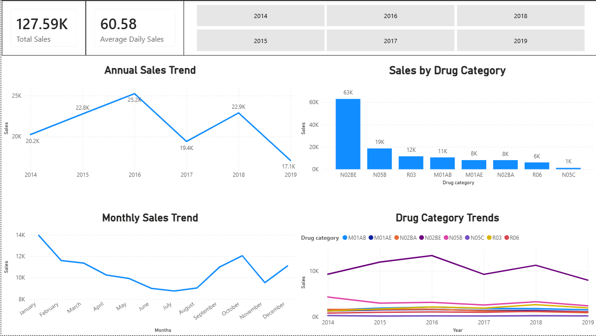
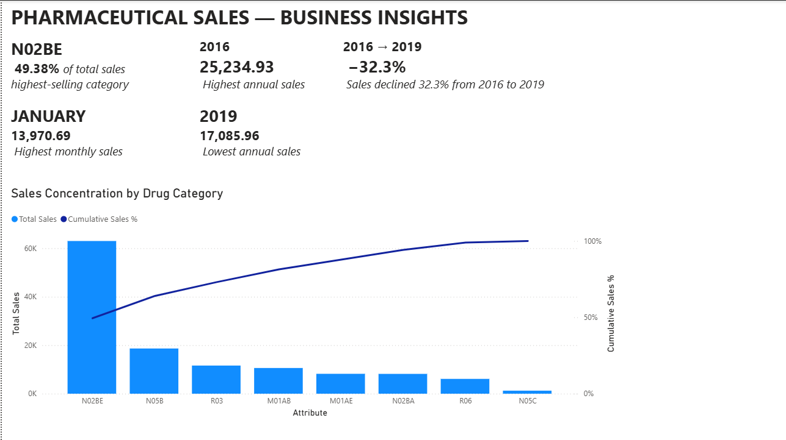

# Pharma-drug-sales-analysis
Pharma Sales Analysis & Power BI Dashboard

Python + Power BI analysis of 2,106 daily pharmaceutical sales records (2014–2019), digging into product concentration, seasonality, and time-of-day patterns, then turned into a two-page interactive dashboard.

Data
2,106 daily observations, 2014–2019
Fields: date, hour, product category, sales volume
[Add source/link here — Kaggle, synthetic, etc.]
What I did

Exploratory analysis

Daily, monthly, and annual sales trends
Day-of-week and hourly sales patterns
Product contribution and product performance by year
Outlier and distribution checks

Statistical testing

Descriptive stats and product-to-product correlation
One-way ANOVA + Tukey HSD, run separately for products and for years
Linear regression to test for a long-term sales trend
Key findings

1. Sales are concentrated in one product. N02BE accounts for 49% of total sales on its own. N05B (15%) and R03 (9%) are next. The rest is a long tail.

2. 2016 was the peak year, then things trended down. 2016 hit 25,235 in annual sales, the high point in the dataset. Sales dropped in 2017, recovered somewhat in 2018, then fell to the lowest point in the data (17,086) in 2019.

3. Sales are seasonal. January is the strongest month (13,971 cumulative), July the weakest (8,993). Sales dip mid-year and recover toward year-end.

4. Sales activity peaks in the evening. Hourly totals climb through the day and peak around 20:00 (~53,311 in total sales at that hour).

5. The differences are real, but there's no clean linear trend. ANOVA confirms statistically significant differences between products and between years. But a linear regression on sales over time comes back non-significant (p = 0.257, R² = 0.0006) — so "sales are trending up/down over time" isn't a claim the data supports. Whatever's driving the year-to-year swings, it isn't a steady trend; it's more likely product mix, seasonality, or external factors not captured here.

## Dashboard

**Page 1 — Sales Overview**



**Page 2 — Business Insights**




## Repo structure

```text
├── data/
│   ├── salesdaily.csv
│   └── saleshourly.csv
├── notebooks/
│   └── Final_analysis.ipynb
├── dashboard/
│   ├── pharma_sales_analysis_dashboard.pbix
│   ├── dashboard_page1.png
│   └── dashboard_page2.png
├── README.md
└── LICENSE
```


How to run
bash
git clone <repo-url>
cd <repo-name>
pip install -r requirements.txt
jupyter notebook notebooks/pharma_sales_analysis.ipynb

Open dashboard/pharma_sales_dashboard.pbix in Power BI Desktop to view the dashboard.

Tools

Python (Pandas, NumPy, SciPy, Matplotlib, Seaborn), Power BI, DAX

Limitations / next steps
No linear trend was found over the full time range — worth testing for structural breaks or seasonality-adjusted trend instead of a single regression across all years.
Product-level drivers behind the 2019 drop aren't investigated here; that's a natural next cut of this data.
